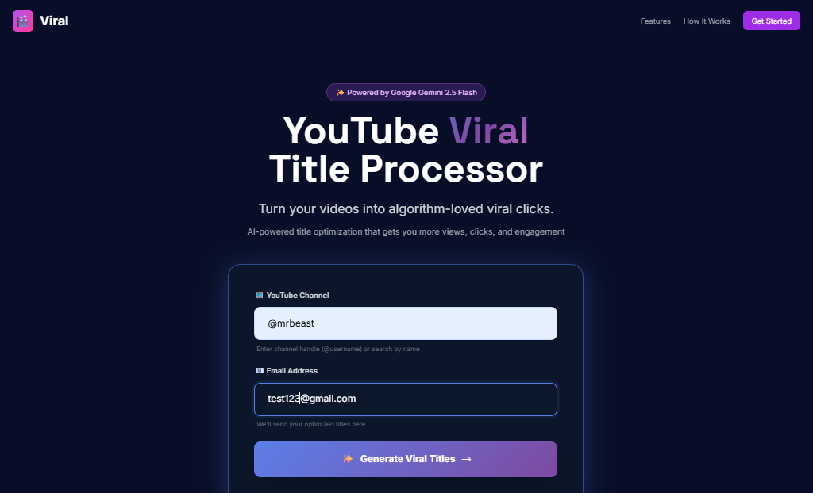
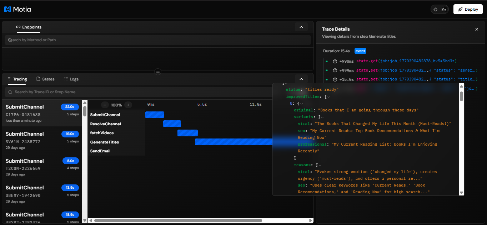
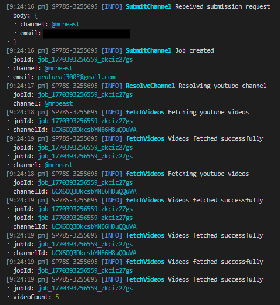
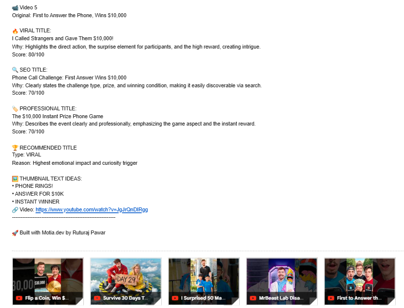

# 🎬 YouTube Title Processor

**AI-powered YouTube title optimization built with Motia workflows**

Turn raw YouTube titles into **viral, SEO-optimized, and brand-safe recommendations**.  
It generates multiple title variations, compares their potential performance, and uses **AI to recommend the strongest title to publish**, along with a short explanation.

## Visual Walkthrough

### User Interface (Frontend)

*Simple form where users submit YouTube channels and receive AI-powered title suggestions*
---

### Motia Workbench (Event Flow Visualization)

*Real-time event-driven workflow execution in Motia's visual debugger*

---

### Terminal Logs (Runtime Execution)

*Step-by-step processing logs showing the entire pipeline in action*

---

### Email Delivery (Final Output)

*AI-generated viral, SEO, and professional title variants delivered via email*

---

## Tech Stack

- **Motia** – workflows & steps
- **Gemini API** – AI title generation
- **Resend** – email delivery
- **TypeScript**

---

## Problem

Creators struggle with:

- Choosing the right title
- Balancing **virality vs SEO**
- Making decisions based on intuition instead of data

Even great videos fail due to poor titles, leading to **low CTR and low reach**.

---

## Solution

**YouTube Title Processor** uses **Motia’s unified backend runtime** to:

- Analyze recent YouTube videos from a channel
- Generate **three optimized title variants per video**:
  - Viral (emotion and curiosity driven)
  - SEO (keyword-rich and discoverable)
  - Professional (brand-safe and clean)
- Score titles for viral potential
- Automatically recommend the **best-performing title** with reasoning
- Deliver a clean, decision-ready email report

No dashboards. No clutter. Just decisions.

---

## Key Features

### A/B/C Title Testing
- Viral: emotional and curiosity-driven
- SEO: optimized for search discovery
- Professional: clean and brand-safe

### AI “Best Pick” Recommendation
- Compares title performance scores
- Selects the highest-impact title
- Explains why it was chosen

### Thumbnail Text Generator
- Three short, emotional thumbnail phrases per video
- Optimized for CTR (3–4 words max)

### Email-First UX
- Clean, readable SaaS-style report
- Output understandable in under 30 seconds
- Designed for fast decision-making

---

## Why Motia?

This project leverages **Motia’s core strengths**:

- Steps as a single core primitive
- Event-driven workflows
- Durable state management
- Clean separation of concerns
- Production-ready execution model

No extra queues, cron jobs, or background services required.

---

## Workflow Architecture

1. API Step – Submit channel name and email
2. Resolve Channel Step – Fetch channel details
3. Fetch Videos Step – Get recent uploads
4. AI Title Step – Generate variants, scores, and recommendation
5. Email Step – Send final report
6. Error Handler Step – Graceful failure handling

All orchestrated using **Motia workflows**.

---

## Future Improvements

- Weighted scoring (SEO vs brand vs viral)
- Batch channel analysis
- Creator performance tracking

---

## How to Run the Project

This project runs the frontend and backend separately.

### Frontend

The frontend is located inside the `public` folder.

```bash
cd public
npx http-server -p 3005
```

### Backend (Motia Workbench)
From the **root directory** of the project
```bash
npm run dev
```
This starts the Motia backend runtime and you will be able to see **Motia Workbench** UI there.


## Built for

**Backend Reloaded Hackathon**  
WeMakeDevs × Motia

